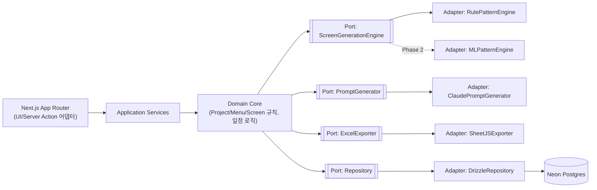
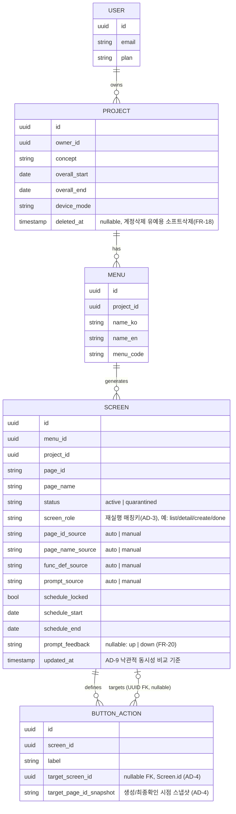
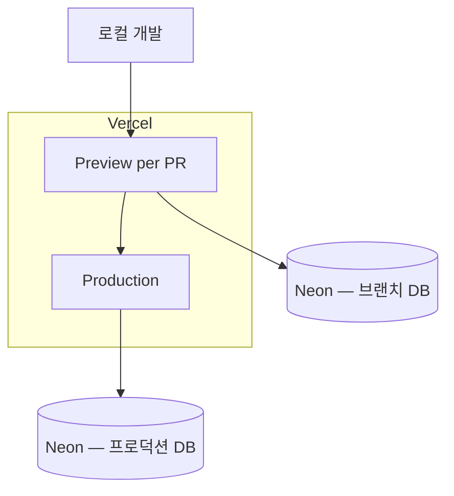

# Architecture Spine — IA 자동생성 플랫폼

## Design Paradigm

**Hexagonal (Ports & Adapters).** 도메인 코어(프로젝트/메뉴/화면 규칙, 일정 로직)는 외부 기술에 의존하지 않고, 세 가지 교체 가능한 능력을 포트로 분리한다:

- `ScreenGenerationEngine` — 메뉴의 "원하는 기능" 서술로부터 화면 목록을 만드는 능력(FR-7). MVP 어댑터는 규칙기반 패턴 매칭.
- `PromptGenerator` — 화면별 AI 프롬프트를 만드는 능력(FR-12). `[2026-07-13 정정]` MVP 어댑터부터 **Claude API(모델: `claude-haiku-4-5`) 기반 실제 LLM 호출**로 구현한다 — 원래 계획(MVP는 템플릿 조합, Phase 2에 LLM 도입)은 원가 확인(프로젝트당 100~300원 수준) 후 폐기, 규칙기반 템플릿 어댑터는 만들지 않는다.
- `ExcelExporter` — 화면/메뉴/프로젝트 데이터를 .xlsx로 직렬화하는 능력(FR-14~16).

`PromptGenerator`가 처음부터 실제 LLM 어댑터라 해도 포트 경계는 여전히 유효하다 — 향후 모델 교체(예: 품질 이슈 시 Sonnet으로 승급)나 재시도/폴백 전략 변경이 호출부를 건드리지 않게 하기 위함이다. `ScreenGenerationEngine`은 여전히 MVP=규칙기반, Phase 2=패턴 라이브러리 확장 계획을 유지한다(FR-7). Next.js 앱 자체는 이 코어를 감싸는 하나의 어댑터(UI/Server Action 어댑터)로 취급한다. 모든 쓰기 경로(인라인 편집, 그리드 저장, 재실행, 재계산)는 반드시 Application Service의 단일 커맨드 함수를 통과한다 — 어댑터가 여러 개여도 도메인 진입점은 하나다.



## Invariants & Rules

### AD-1 — 도메인 코어는 어댑터를 모르고, 어댑터는 Repository를 직접 호출하지 않는다
- **Binds:** all
- **Prevents:** UI 컴포넌트나 라우트 핸들러 안에 화면생성/프롬프트생성/엑셀생성 로직이 직접 섞여 들어가거나, 두 팀이 같은 포트를 서로 다른 입출력 계약으로 구현해 Phase 2 교체 시 호출부까지 다시 손대야 하는 상황
- **Rule:**
  - `ScreenGenerationEngine`, `PromptGenerator`, `ExcelExporter`, `Repository`는 인터페이스(포트)로 도메인 계층에 정의하고, 구현(어댑터)은 별도 모듈에서 주입한다. 도메인 계층은 Next.js, Drizzle, SheetJS를 import하지 않는다. 이 경계는 CI에서 `dependency-cruiser`(또는 `eslint-plugin-boundaries`) 규칙으로 강제하며, 선언만으로 끝내지 않는다.
  - 포트 최소 계약을 고정한다: `ScreenGenerationEngine.generate(input: { project: Pick<Project,'device_mode'|'concept'>, menu: Menu, existingScreens: Screen[] }): ScreenDraft[]` — 어댑터가 스스로 Repository를 조회하지 않고, 필요한 데이터는 Application Service가 조립해 넘긴다. `PromptGenerator.generate(input: { screen: Screen, menu: Menu, siblingScreens: Screen[], projectConcept: string }): string` — Phase 2가 요구하는 "형제 화면 + 사이트 컨셉 반영"까지 MVP 시그니처에 이미 포함해, 어댑터 교체 시 포트 자체를 깨지 않는다.
  - 어댑터는 Repository를 직접 호출할 수 없다(인가 경계 AD-7을 어댑터가 우회하지 못하도록).

### AD-2 — page_id와 menu_code의 고유성은 프로젝트 스코프이며, 예약어는 도메인 상수로 관리한다
- **Binds:** FR-5, FR-9
- **Prevents:** 서로 다른 프로젝트의 ID가 우연히 같아서 전역 유니크 제약에 걸리거나, menu_code 중복/예약어 충돌 검증을 UI와 도메인이 각자 다르게 구현하는 상황
- **Rule:** `screen.page_id`는 `(project_id, page_id)` 복합 유니크, `menu.menu_code`는 `(project_id, menu_code)` 복합 유니크로 DB 제약을 건다. 예약어 목록(`PC`, `MO`)과 "영문 표기 1글자 불가" 규칙은 도메인 상수로 한 곳에 정의하고 UI 검증과 서버 검증이 같은 상수를 참조한다(별도로 하드코딩하지 않는다). 전역 유니크 인덱스는 걸지 않는다.

### AD-3 — 메뉴 삭제는 화면을 격리할 뿐 삭제하지 않으며, 재실행 매칭은 안정적 키로만 수행한다
- **Binds:** FR-6, FR-8
- **Prevents:** 메뉴 삭제 시 화면이 즉시 사라져 다른 화면의 버튼-액션 참조가 조용히 끊기는 상황, 그리고 재실행 시 화면 후보와 기존 DB 행을 페이지ID 추측이나 일련번호 예측으로 잘못 매칭해 중복 생성/스킵이 발생하는 상황
- **Rule:**
  - 메뉴 삭제는 소속 `screen.status`를 `quarantined`로 전환할 뿐 행을 삭제하지 않는다. 사용자가 격리된 화면을 최종적으로 하드 삭제하는 것은 허용하되(FR-6), 그 화면을 대상으로 하는 `button_action`이 하나라도 남아 있으면 삭제를 막고 먼저 참조를 정리하도록 안내한다(AD-4의 참조 정리 흐름과 동일 UX).
  - `ScreenGenerationEngine`이 반환하는 각 화면 후보는 안정적 매칭 키 `(menu_id, screen_role)`(패턴 라이브러리가 부여하는 화면 유형 태그, 예: `list`/`detail`/`create`/`done`)를 포함한다. 재실행 시 기존 화면과의 매칭은 이 키로만 수행하며, `page_id` 문자열이나 일련번호 추측으로 매칭하지 않는다.

### AD-4 — 화면 간 참조는 대상 행(UUID)을 가리키되, "이름 변경"과 "격리/삭제"는 서로 다른 경고로 구분한다
- **Binds:** FR-11
- **Prevents:** 참조가 UUID FK인지 page_id 문자열인지가 스파인과 PRD 사이에서 엇갈려, 한 구현은 DB 참조 무결성을 잃고 다른 구현은 "대상 화면 이름이 바뀌면 알려준다"는 PRD 요구를 잃는 상황
- **Rule:**
  - `button_action.target_screen_id`는 대상 `Screen.id`(UUID)를 가리키는 FK다 — page_id 문자열을 저장하지 않는다. 이렇게 하면 대상 화면의 `page_id`가 바뀌어도 참조 자체(행)는 깨지지 않는다.
  - 다만 PRD가 요구하는 "대상 페이지ID가 변경되면 알려준다"를 만족시키기 위해, `button_action`은 생성/최종 확인 시점의 대상 `page_id`를 `target_page_id_snapshot`에 함께 저장한다. 조회 시점에 `target_page_id_snapshot ≠ 현재 target_screen.page_id`이면 "대상 페이지ID 변경됨" 경고를, 대상 화면이 `quarantined`이거나 존재하지 않으면 "깨진 링크"를 파생 계산한다 — 두 경고는 별개다.
  - 격리된 화면의 하드 삭제는 AD-3의 규칙(참조가 남아 있으면 삭제 금지)을 따른다.

### AD-5 — 자동생성 대 수동수정은 필드 단위로, 값의 실제 변경 여부로만 판정한다
- **Binds:** FR-3, FR-8, FR-13, NFR-2, NFR-7
- **Prevents:** 인라인 편집 경로와 그리드/벌크 저장 경로가 `*_source` 전환 조건을 다르게 구현해(예: "페이로드에 포함되면 manual" vs "실제 값이 다르면 manual") 같은 화면인데 경로에 따라 재실행/재계산 보호 여부가 달라지는 상황
- **Rule:**
  - 화면의 편집 가능 필드 그룹(페이지ID/페이지명, 기능정의, AI프롬프트, 일정)마다 별도의 `*_source`(`auto`|`manual`) 플래그를 둔다. 일정 필드는 `schedule_locked` 플래그로 재계산 보호 여부를 결정한다.
  - `*_source`는 저장 직전 "변경 전 값과 실제로 다른가"의 diff로만 `manual`로 전환한다. 요청 페이로드에 필드가 포함되어 있다는 사실만으로는 전환하지 않는다.
  - 화면 데이터를 바꾸는 진입점(단일 필드 인라인 편집, 그리드 다중 저장, 재실행, 재계산)은 모두 Application Service의 단일 커맨드 `updateScreenFields()`를 통과한다 — UI 경로별로 별도의 update 함수를 만들지 않는다.

### AD-6 — 파생 경고 상태는 저장하지 않고, 배치 조회로 계산하며, 서로 다른 원인은 서로 다른 경고로 구분한다
- **Binds:** FR-11, FR-13, NFR-3
- **Prevents:** "깨진 링크/범위 이탈/일정 역전/메뉴코드 혼재/디바이스방식 혼재"를 컬럼에 캐싱했다가 갱신을 깜빡해 실제와 어긋나는 상황, 화면별 개별 쿼리로 인한 N+1 병목, 그리고 원인이 다른 두 "혼재" 경고(메뉴코드 vs 디바이스방식)를 하나로 뭉뚱그려 사용자가 원인을 구분할 수 없는 상황
- **Rule:**
  - 깨진 링크(AD-4), 범위 이탈 일정, 일정 역전, **메뉴코드 혼재**(화면의 `page_id`에 반영된 코드가 소속 메뉴의 현재 `menu_code`와 다름), **디바이스방식 혼재**(화면의 페이지ID 형식이 프로젝트의 현재 `device_mode`와 다름)는 모두 별도 경고이며, 조회 시점에 관련 데이터로부터 매번 계산한다. 별도 상태/이력 컬럼을 두지 않는다.
  - 화면 리스트 조회 시 이 경고들은 화면별 개별 쿼리가 아니라 프로젝트 단위 배치 조회/조인으로 한 번에 계산한다.

### AD-7 — 인가는 Application Service 계층의 공통 래퍼로 구현하며, 라우팅 미들웨어에 의존하지 않는다
- **Binds:** NFR-1, FR-2, FR-18
- **Prevents:** 일부는 `middleware.ts`로, 일부는 서비스 내부 검사로 인가를 구현해 Server Action이나 새 라우트가 검사망을 조용히 빠져나가는 상황
- **Rule:** 프로젝트/메뉴/화면을 다루는 모든 Application Service 함수는 공통 래퍼 `withProjectAuth(fn)`를 통해서만 export되고, 래퍼가 `project.owner_id === session.user.id`를 확인한 뒤에만 내부 로직(및 Repository 호출)을 실행한다. Next.js `middleware.ts`(라우팅/엣지 계층)는 인가 판단에 사용하지 않는다 — Server Action은 URL 패턴만으로 대상 프로젝트를 알 수 없어 미들웨어가 검사를 건너뛸 수 있기 때문이다. 데이터 변경은 Server Action을 기본 경로로 사용한다(REST API Route는 엑셀 다운로드처럼 파일 응답이 필요한 경우에만).

### AD-8 — 코드/방식이 바뀌어도 이미 발급된 page_id는 소급 변경하지 않는다
- **Binds:** FR-6, FR-9
- **Prevents:** "일관성을 지킨다"는 선의로 menu_code나 device_mode 변경 시 기존 화면들의 page_id를 일괄 치환(find-and-replace)해, 이미 엑셀로 내보내 AI 코딩 도구에 넘긴 페이지ID 참조를 조용히 깨뜨리는 상황
- **Rule:** `menu.menu_code` 또는 `project.device_mode`가 변경되어도 기존에 발급된 `screen.page_id` 값을 일괄 UPDATE하는 로직을 두지 않는다. 새 코드/방식은 이후 신규 생성되는 화면에만 적용되며, 하나의 메뉴/프로젝트 안에 신·구 규칙이 혼재하는 상태(AD-6의 "혼재" 경고 대상)를 정상 상태로 전제하고 설계한다.

### AD-9 — 동시 편집 충돌은 낙관적 동시성 제어로 MVP부터 감지한다
- **Binds:** NFR-2
- **Prevents:** 같은 사용자가 두 탭에서 같은 화면을 편집할 때 나중 저장이 먼저 저장분을 조용히 덮어써, "수동 수정 데이터는 유실되지 않아야 한다"는 NFR-2를 깨는 상황
- **Rule:** `updateScreenFields()`(AD-5)는 클라이언트가 마지막으로 읽은 `updated_at`을 함께 받아 현재 DB 값과 비교한다. 불일치 시 저장을 거부하고 409 충돌 응답을 반환한다 — 정교한 병합 UX는 Deferred, 최소 감지는 MVP.

## Consistency Conventions

| Concern | Convention |
| --- | --- |
| Naming (엔티티/파일/이벤트) | 엔티티는 단수 PascalCase(`Project`, `Menu`, `Screen`, `ButtonAction`), DB 테이블/컬럼은 snake_case. 포트 인터페이스는 `XxxPort` 또는 능력명 그대로(`ScreenGenerationEngine`), 어댑터는 `{기술}{포트명}Adapter` 또는 관용명(`SheetJSExporter`). |
| 데이터/포맷 (ID, 날짜, 에러, 텍스트 길이) | 내부 PK는 UUID. `page_id`는 PRD 규칙의 사람이 읽는 문자열(`{DEVICE}{MENUCODE}{NNNN}`)이며 내부 PK와 별개 컬럼. 날짜는 UTC ISO 8601 저장, 표시는 클라이언트 타임존. API 에러 응답은 `{ error: { code, message } }` 단일 포맷. 화면기능정의·AI프롬프트 필드는 도메인 상수(`MAX_TEXT_LENGTH = 30,000`자, NFR-8의 엑셀 셀 한도 32,767자 대비 여유)로 서버/클라이언트가 동일 값을 참조해 검증한다. |
| 상태/횡단 관심사 (뮤테이션, 로깅, 인증, 설정) | 상태 변경은 AD-5의 `updateScreenFields()`처럼 Application Service의 단일 커맨드로만(라우트/컴포넌트가 Repository 직접 호출 금지). 인가는 AD-7의 `withProjectAuth` 래퍼로만. 환경설정은 `.env` + Vercel 환경변수, 코드에 하드코딩 금지. `domain/` ↔ `adapters/` 경계는 CI에서 `dependency-cruiser` 규칙으로 강제(AD-1). |

## Stack

| Name | Version |
| --- | --- |
| Next.js (App Router) | 16.2.10 (2026-07 기준 stable LTS, 웹검증됨) |
| React | 19.x (Next.js 16 번들 기준) |
| TypeScript | 5.x |
| Tailwind CSS | 4.x (CSS `@theme` 방식, `@tailwindcss/postcss`) |
| shadcn/ui | Tailwind v4 + React 19 대응 최신판 |
| Drizzle ORM | v1.0 GA 계열(2026-07 기준 beta.22 후속 릴리스 진행 중) — 웹검증됨. Prisma 대비 엣지친화적·의존성 0개·Neon 네이티브 어댑터 |
| Neon (서버리스 Postgres) | — (2025 Databricks 인수, "Neon" 브랜드 독립 운영 지속) |
| Better Auth | 1.6.23 stable(2026-06 기준) — 웹검증됨. Next.js 16 App Router + Drizzle + Neon 조합이 2026년 사실상 표준 스타터 패턴 |
| SheetJS (xlsx) | 0.20.3+ — **공개 npm 레지스트리의 `xlsx` 패키지명으로 설치 금지**(방치·취약점 다수 확인됨). `https://cdn.sheetjs.com/xlsx-<version>/xlsx-<version>.tgz` tarball을 package.json 의존성으로 고정 설치 |
| Vercel | 배포 플랫폼 (Next.js 네이티브) |
| `@anthropic-ai/sdk` | `[2026-07-13 추가]` `PromptGenerator`의 `ClaudePromptGenerator` 어댑터(FR-12)가 사용. 모델은 `claude-haiku-4-5`(짧고 구조화된 화면별 프롬프트 생성에 적합, 원가 최소). `ANTHROPIC_API_KEY`는 Vercel 환경변수로 주입, 코드에 하드코딩 금지. Story 3.4 착수 시 설치 |

## Structural Seed

```text
{repo-root}/
  app/                      # Next.js App Router — 라우트, Server Action (UI 어댑터)
    (auth)/                 # 로그인/가입
    (dashboard)/            # 대시보드, 프로젝트 목록
    projects/[projectId]/
      settings/             # 프로젝트 설정 (컨셉/일정/디바이스방식)
      menus/                # 메뉴 관리
      screens/              # 화면 리스트 + 상세 패널
  application/               # Application Services — withProjectAuth로 감싼 단일 진입점들
    updateScreenFields.ts    # AD-5의 유일한 화면 수정 커맨드
    regenerateScreens.ts     # FR-7/FR-8
    recalculateSchedule.ts   # FR-3/FR-13
  domain/                   # 도메인 코어 — 외부 기술 import 금지 (AD-1, CI로 강제)
    project/ menu/ screen/ schedule/
    ports/                  # ScreenGenerationEngine, PromptGenerator, ExcelExporter, Repository 인터페이스
  adapters/
    generation/rule-pattern/    # MVP ScreenGenerationEngine 구현
    prompt/template/            # MVP PromptGenerator 구현
    prompt/llm/                 # Phase 2 PromptGenerator 구현 (자리만 예약)
    export/sheetjs/              # ExcelExporter 구현 (cdn.sheetjs.com tarball 사용)
    repository/drizzle/          # Repository 구현 (Neon 연결)
  db/
    schema.ts                 # Drizzle 스키마 정의
    migrations/
```





## Capability → Architecture Map

| Capability / Area | Lives in | Governed by |
| --- | --- | --- |
| FR-1~3 프로젝트/전체일정 | `app/projects/[id]/settings`, `domain/project`, `application/recalculateSchedule` | AD-5, AD-7, AD-9 |
| FR-4~6 메뉴 관리 | `app/projects/[id]/menus`, `domain/menu` | AD-2, AD-3, AD-8 |
| FR-7~8 IA 생성/재생성 | `domain/screen`, `adapters/generation/rule-pattern`, `application/regenerateScreens` | AD-1, AD-3, AD-5 |
| FR-9~11 화면 상세(페이지ID/명/기능정의) | `app/projects/[id]/screens`, `domain/screen` | AD-2, AD-4, AD-5, AD-6, AD-8 |
| FR-12, FR-20 AI프롬프트·피드백 | `adapters/prompt/llm`(Claude API, `[2026-07-13]` MVP부터), `SCREEN.prompt_feedback` | AD-1, AD-5 |
| FR-13 일정 산정 | `domain/schedule` | AD-5, AD-6, AD-9 |
| FR-14~16 엑셀 내보내기 | `adapters/export/sheetjs` | AD-1 |
| FR-17 GNB/Footer | `app/(dashboard)/layout.tsx` 등 공통 레이아웃 | — (UX 스파인 EXPERIENCE.md IA 참조) |
| FR-18~19 계정/인증 | `app/(auth)`, Better Auth 세션, `PROJECT.deleted_at` | AD-7 |

## Deferred

- **결제/구독 연동**: PRD가 명시적으로 이번 범위 밖으로 뒀다. `User.plan` 필드만 확장 가능하게 예약, 실제 결제 게이트웨이 연동은 별도 스파인에서.
- ~~LLM 기반 PromptGenerator 구현 상세: 포트 계약(AD-1)만 이번에 고정~~ → `[2026-07-13]` **더 이상 Deferred 아님.** MVP부터 Claude API(`claude-haiku-4-5`) 실제 호출로 확정(프로젝트당 원가 100~300원 확인 완료). 남은 미정 사항: API 실패/장애 시 폴백 전략(재시도 vs 최소 안내 vs 규칙기반 대체 문구) — 이건 Story 3.4 착수 시 결정.
- **ScreenGenerationEngine의 패턴 라이브러리 확장 범위**: 커머스/회원/게시판 외 도메인 패턴 추가 우선순위는 PRD Open Question대로 미정.
- **동시 편집의 정교한 병합 UX**: AD-9로 MVP 감지(409 충돌)는 고정했으나, 충돌 시 화면단 병합/재시도 UX는 미정.
- **일정 슬롯 부족 시 신규 화면 배정 알고리즘**: PRD Open Question 그대로 이관.
- **프로젝트 소유권 이전/공유**: PRD가 Phase 3 후보로 남긴 항목. User↔Project가 현재 1:N이라 `PROJECT_MEMBER` 조인 테이블 추가로 확장 가능한 형태만 확인, 지금 만들지 않는다(YAGNI).
- **대용량 프로젝트의 엑셀 생성 성능 상한**: NFR-3이 "수 초~수십 초"로만 명시. 실제 화면 수 상한/타임아웃 값은 미정. `ExcelExporter` 어댑터는 SheetJS가 서버리스 환경에서 메모리 이슈를 보이면 ExcelJS로 교체 가능(AD-1의 포트/어댑터 구조 덕분에 교체 비용 낮음).
- **운영/관측가능성**: 에러 트래킹·로깅·모니터링 도구 미정. MVP는 Vercel 기본 로그로 대응하고, 트래픽이 늘면 Sentry(또는 동급) 도입을 재검토한다.
- **레이트리미팅/어뷰징 방지**: 회원가입, [실행: IA 생성](계산 비용 발생), 엑셀 다운로드에 대한 남용 방지 정책 미정. Phase 2에서 결정.
- **데이터 백업/보존 정책**: Neon의 PITR/브랜치 기능은 이름만 확정, 보존 기간·복구 절차는 미정.
- **계정 삭제 유예(30일) 후 실제 하드 삭제 배치**: `PROJECT.deleted_at` 컬럼은 이번에 고정했으나, 유예기간 경과 후 하드 삭제를 수행하는 크론/배치 잡의 구체 구현은 미정.
